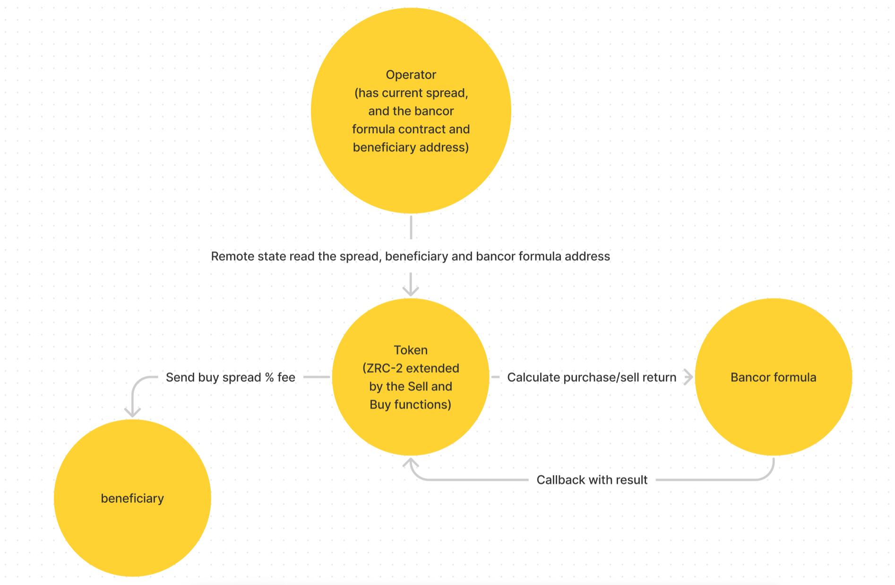

# Bancor Continuous Token Bonding Curve Scilla Contracts

This repository contains 3 scilla contracts that issues its own tokens through buy and sell functions. To buy tokens, you send a reserve token that can be $zil or a stablecoin to the buy function which calculates the average price of the token in reserve token terms and issues you the correct amount. The sell function works in reverse: first you provide the bonding contract with permission to take the amount of tokens you want to sell and then you trigger the function to take those tokens from you. The contract will calculate the current average selling price and will send you the correct amount of $zil or stablecoin. There is a configurable spread (protected by a unchangable max spread) between buying and selling with the spread amount going to an address owned by the development team.

The contract are provided with *PRODUCTION READY TYPESCRIPT TYPESAFE SDKS*

## Overview

There are 3 contracts. Available in ./src/*

-   BancorFormula

Does the bancor formula calculation for the sell and buy functions to work, it sends the result of the calculation in a callback of the Token contract.

-   Operator

Has an admin that can set the current spread of the buy/sell functions, the bancor formula implementation and the fee beneficiary address.

-   Token

The changed ZRC-2 contract that now also now can be pegged to a ZIL or any other ZRC2 token to make it its connected token (provides the aformentioned sell and buy functions for the token).

The contract has a one time initialization transition to initialize it with the market cap of the token and the initial CW (see the bancor paper for what is CW or Connector Weight)

Buy function: Simply send the connected token to the contract address, the contract will automatically send back its smart token!

Sell function: Simply send the smart token to the contract address, the contract will automatically send back its connected token!

## How does it look like?



Q: Why is the bancor formula in a separate contract?

A: The contract computation is expensive so any evaluation of the entire contract content should be evaluated only when Sell or Buy is actually triggered! Otherwise we would be introducing massive costs to the ZRC-2 protocol!

## Info

Going to ./src/Operator ./src/BancorFormula ./src/Token, you can find their respective READMEs. As well as their PRODUCTION READY SDKS.

## Testing

There are unit and integration tests!

All tests are located in ./src/*./\_\_tests\_\_ directories!


### Running tests

In this directory (we need to run local isolated server for integration testing):

Make sure that you have the Docker desktop daemon runnnig and run

```bash
npm run demo
```

If you want to work on this just go to package json and look how the demo script is implemented. It clones and runs the zilliqa isolated server which is needed for integration testing and then runs it on port 5555 and calls npm i && npm run test

# Other

Tip: The Token contract supports both ZIL and ZRC2 out of the box however not to introduce unneeded gas costs I would recommed trimming the contract to support only ZIL or ZRC2 depending on the usecase!

./dev.ipynb is the notebook used for making of parts of the contracts and research.

Sources: 

https://github.com/AragonBlack/fundraising/blob/master/apps/bancor-formula/contracts/BancorFormula.sol

https://github.com/AragonBlack/fundraising/blob/master/apps/tap/contracts/Tap.sol

https://discourse.sourcecred.io/t/bonding-curve-references/271

https://storage.googleapis.com/website-bancor/2018/04/01ba8253-bancor_protocol_whitepaper_en.pdf